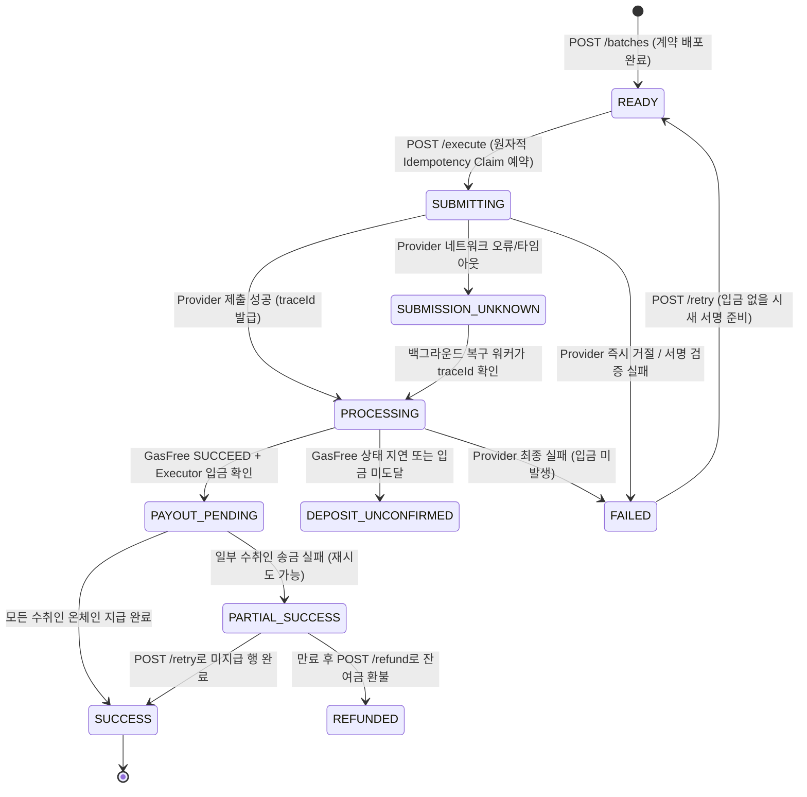

> 현재 배포 프론트는 수동 GasFree 입금 후 direct execute를 사용합니다. [배포 링크·지갑 지원 범위](docs/CURRENT_INTEGRATION_KO.md). 아래 signed 경로는 백엔드 호환 기능이며 현재 웹의 서명 기능을 뜻하지 않습니다.

# TRON Batch Payment API 명세서 (API Specification)

> 2026-09-30 통합 정정: `/progress`는 단일 경로이며 stages/evidence/paymentPercent와 counts.success/submitted, 호환 별칭 counts.succeeded/inFlight를 제공한다. financials.principalPaid/totalAmount는 소수점 6자리 문자열이다. actualFeesTotal은 근거를 조회하지 않아 null이며 실제 비용 근거는 `/fees`를 확인한다. 저장된 reconciliationStatus가 없으면 null이고 SUCCESS로부터 FINAL을 합성하지 않는다. threeWayAudit 잔액 근거가 없으면 matched=null이다. 공개 대시보드는 서버 Bearer를 HTML에 삽입하지 않는다.

본 문서는 `src/server.cjs`, `src/db.cjs`, `src/gasfree.cjs`, `src/tron.cjs`의 실제 구현을 바탕으로 작성된 **TRON Nile 테스트넷 기반 가스 프리(GasFree) 일괄 지급(Batch Payment) 백엔드 서버 API 명세서**입니다.

---

## 1. 개요 및 아키텍처

- **프로젝트 목적**: 사용자가 단 한 번의 TIP-712 가스 프리(`PermitTransfer`) 서명만으로 다수의 수취인에게 TRC-20 토큰(USDT 등)을 가스비 없이 분배할 수 있는 일괄 송금 인프라 제공.
- **주요 워크플로우**:
  1. **견적 (`POST /quote`)**: 클라이언트가 전송할 수취인 목록을 전달하여 가스 프리 수수료 및 릴레이어 예상 비용 산출.
  2. **배치 생성 (`POST /batches`)**: 서버가 Merkle Tree를 구성하고 온체인 `BatchFactory`를 통해 CREATE2 경량 클론 `BatchExecutor`를 사전 배포·초기화.
  3. **사용자 서명 (Client-Side)**: 사용자는 배포된 `BatchExecutor` 주소를 수신자(`receiver`)로 지정하는 TIP-712 `PermitTransfer`에 서명 (개인키는 절대 서버로 전송되지 않음).
  4. **배치 실행 (`POST /batches/:batchId/execute`)**: `Idempotency-Key` 헤더와 함께 서명을 전달하면, 서버가 공식 GasFree Provider에 트랜잭션을 제출하고 온체인 입금 확인 후 각 행별로 Merkle Proof를 제출하여 `BatchExecutor.execute(...)`를 순차 실행.
  5. **상태 모니터링 & 복구**: 단일 배치 상태(`GET /batches/:id`), 수취인별 내역(`GET /batches/:id/payments`), 실시간 SSE 스트림(`GET /batches/:id/events`) 및 자동 복구 워커 제공.

---

## 2. 공통 규격 및 정책

| 항목 | 규격 및 정책 |
| :--- | :--- |
| **기본 URL** | `http://localhost:3000` (포트 기본값: `3000` / 환경변수 `PORT`) |
| **네트워크** | TRON Nile Testnet (`https://nile.trongrid.io`) |
| **인증 (Auth)** | `GET /health`를 제외한 모든 엔드포인트에 `Authorization: Bearer <API_BEARER_TOKEN>` 필수. (최소 32자 이상) |
| **SSE 인증** | 브라우저 `EventSource`의 커스텀 헤더 한계를 지원하기 위해 `ENABLE_SSE_QUERY_TOKEN=1` 설정 시 `?token=<API_BEARER_TOKEN>` 쿼리 파라미터 허용. |
| **요청 본문 포맷** | `Content-Type: application/json` |
| **주소 표기** | TRON Base58 형식 (예: `TPCozYqnistWHH9VaoJtjXp5djKX4VJgai`) |
| **금액 표기** | 토큰의 최소 단위(Base Unit) 정수형 문자열 (예: Nile USDT 6 decimals 기준 1 USDT = `"1000000"`). |
| **시간 단위** | `expiry`, `deadline`: Unix 타임스탬프 (초 단위, seconds)<br>`createdAt`, `updatedAt`: Unix 타임스탬프 (밀리초 단위, ms) |
| **에러 응답 규격** | 실패 시 `{ "error": "에러 설명 메시지" }` 형식의 JSON 반환 |

---

## 3. 상태 머신 (State Machine)

### 3.1 배치 상태 (`batch.status`)


### 3.2 개별 송금 행 상태 (`payment.status`)
- `PENDING`: 지급 대기 중
- `SUBMITTING`: 릴레이어가 `execute` 트랜잭션을 온체인에 브로드캐스트 중
- `CONFIRMED`: 트랜잭션 확정 또는 계약 `paid(index) == true` 검증 완료
- `FAILED`: 트랜잭션 실행 실패 (`OUT_OF_ENERGY`, Revert 등)

---

## 4. API 엔드포인트 명세

### 4.1 시스템 상태 확인 (Health Check)
서버 및 프로세스 동작 상태를 확인합니다. 인증이 필요하지 않습니다.

- **메서드**: `GET`
- **경로**: `/health`
- **인증**: 없음
- **응답 (200 OK)**:
```json
{
  "status": "ok",
  "time": "2026-09-29T08:43:40.123Z"
}
```

---

### 4.2 일괄 지급 견적 조회 (`POST /quote`)
지급할 목록에 대해 GasFree 전송 수수료 및 릴레이어 온체인 실행 예상 수수료(TRX)를 계산합니다.

- **메서드**: `POST`
- **경로**: `/quote`
- **헤더**:
  - `Authorization: Bearer <API_BEARER_TOKEN>`
  - `Content-Type: application/json`
- **요청 본문**:
```json
{
  "sender": "TPCozYqnistWHH9VaoJtjXp5djKX4VJgai",
  "token": "TXYZopYRdj2D9XRtbG411XZZ3kM5VkAeBf",
  "payments": [
    { "recipient": "TPCozYqnistWHH9VaoJtjXp5djKX4VJgai", "amount": "1000000" },
    { "recipient": "TPs87QEVYb6N9g7a8q23eRFf6BrqQLqTJX", "amount": "2000000" }
  ]
}
```
- **요청 필드 제약**:
  - `sender`: 유효한 TRON Base58 사용자 주소
  - `token`: GasFree Provider가 지원하는 TRC-20 토큰 주소
  - `payments`: 1개 이상 1,000개 이하의 배열. 각 `amount`는 양의 정수 문자열
- **응답 (200 OK)**:
```json
{
  "recipientCount": 2,
  "totalAmount": "3000000",
  "estimatedGasFreeFee": "300000",
  "estimatedRelayerFeeTrx": "50.0",
  "estimatedTotal": "3300000",
  "transactionCount": 4
}
```

---

### 4.3 배치 생성 (`POST /batches`)
Merkle Tree를 생성하고 오프체인에서 `BatchFactory`의 CREATE2 결정론적 주소(`predictedAddress`)를 즉시 계산하여 `READY` 상태의 배치를 반환합니다.
- **비용**: **0 TRX** (온체인 트랜잭션을 전송하지 않으므로 릴레이어 가스비 소모 없음)
- **온체인 배포 시점**: GasFree 입금이 온체인에서 확인된 직후, Payout 실행 전에 릴레이어가 자동으로 안전하게 배포합니다.

- **메서드**: `POST`
- **경로**: `/batches`
- **헤더**:
  - `Authorization: Bearer <API_BEARER_TOKEN>`
  - `Content-Type: application/json`
- **요청 본문**:
```json
{
  "sender": "TPCozYqnistWHH9VaoJtjXp5djKX4VJgai",
  "token": "TXYZopYRdj2D9XRtbG411XZZ3kM5VkAeBf",
  "payments": [
    { "recipient": "TPCozYqnistWHH9VaoJtjXp5djKX4VJgai", "amount": "1000000" },
    { "recipient": "TPs87QEVYb6N9g7a8q23eRFf6BrqQLqTJX", "amount": "2000000" }
  ],
  "expiryDuration": 3600
}
```
- **파라미터 설명**:
  - `expiryDuration`: 옵션. 만료 기간(초). 최소 300초 ~ 최대 604,800초 (기본값: 3,600초).
- **응답 (201 Created)**:
```json
{
  "batchId": "b_1790671222552_564f6a4f",
  "batchHash": "0xf0539c58a951654ce63c6324b2a3657094a622981f90b4d55c5ffcc281a54afc",
  "merkleRoot": "0x42eac2242470f20a4cadb14bde5bb66f40cd25320064c1bb2425e70b47899a5c",
  "recipientCount": 2,
  "totalAmount": "3000000",
  "executorAddress": "TSCimoGhAoeVVGzGRyho3bVWxYnfun2vDy",
  "factoryAddress": "TMQYoEzE4LagKinHjKE5GU3MLTtrcuGnFB",
  "implementationAddress": "TY2...someImpl",
  "salt": "0xaf351070fc60a28705177d4be5656c6568f62a42aa89a49749559f550f243368",
  "expiry": 1790674822,
  "status": "READY"
}
```

---

### 4.4 배치 실행 요청 (`POST /batches/:batchId/execute`)
**현재 웹 기본 요청(수동 입금):**

```json
{"mode":"direct"}
```

동일한 필수 헤더를 사용하되 authorization/signature 필드는 보내지 않습니다. `{}` 또는 `{"direct":true}`도 최신 서버 계약에서 수동 모드로 분기합니다. 서버는 executorAddress의 실제 balanceOf를 확인하고 충분하면 200 PROCESSING으로 접수해 병렬 지급을 시작합니다. 부족하면 400 `BatchExecutor balance (...) is insufficient`를 반환합니다. 같은 배치의 응답 유실·재요청에는 동일 Idempotency-Key를 유지합니다. PROCESSING은 지급 확정이 아닙니다.

**호환 signed 요청(지원 지갑 연동용):** 사용자가 승인한 TIP-712 Permit 데이터를 전달하여 GasFree Provider에 입금을 의뢰합니다. 아래 서명 예시는 이 호환 경로에만 적용되며 현재 웹에서는 호출하지 않습니다.

- **메서드**: `POST`
- **경로**: `/batches/:batchId/execute`
- **필수 헤더**:
  - `Authorization: Bearer <API_BEARER_TOKEN>`
  - `Idempotency-Key: <UUID 또는 고유 식별 문자열 (1~128자)>`
  - `Content-Type: application/json`
- **요청 본문**:
```json
{
  "authorization": {
    "token": "TXYZopYRdj2D9XRtbG411XZZ3kM5VkAeBf",
    "serviceProvider": "TKtWbdzEq5ss9vTS9kwRhBp5mXmBfBns3E",
    "user": "TPCozYqnistWHH9VaoJtjXp5djKX4VJgai",
    "receiver": "TSCimoGhAoeVVGzGRyho3bVWxYnfun2vDy",
    "value": "3000000",
    "maxFee": "300000",
    "deadline": "1790671402",
    "version": 1,
    "nonce": 5
  },
  "signature": "0x3ef05c210ab0a3843ebdfab9582a56e85143d19aa1a462c41924c322e9af1a7a5a466854b37cb5216dbb20c474db96dfecd316865e1b229764dd73abc16702d91b"
}
```
- **검증 규칙**:
  - `receiver` == 배치의 `executorAddress`
  - `value` == 배치의 `totalAmount`
  - `token` == 배치의 `token`
  - TIP-712 서명 복원 주소 == 배치의 `sender`
- **응답 (200 OK)**:
```json
{
  "batchId": "b_1790671222552_564f6a4f",
  "traceId": "ef36589f-71e1-4f52-80cb-b5491cf646cb",
  "transactionIds": [],
  "status": "PROCESSING"
}
```

---

### 4.5 직접 실행 (`POST /batches/:batchId/execute-direct`)
이미 `BatchExecutor`에 입금된 토큰의 지급을 시작하는 대체 엔드포인트입니다. 최신 서버 계약상 환경 변수 제약 없이 활성화되며 Bearer 인증은 유지합니다. 현재 웹은 이 경로 대신 `/execute` + `mode: direct`를 사용합니다.

- **메서드**: `POST`
- **경로**: `/batches/:batchId/execute-direct`
- **헤더**: `Authorization: Bearer <API_BEARER_TOKEN>`
- **응답 (200 OK)**:
```json
{
  "batchId": "b_1790671222552_564f6a4f",
  "status": "PROCESSING",
  "fundedBalance": "3000000"
}
```

---

### 4.6 배치 복구 재개 (`POST /batches/:batchId/resume`)
네트워크 단절, 타임아웃 등으로 인해 상태가 멈춘 배치를 온체인 및 Provider 상태와 대조하여 백그라운드 워커에서 즉시 재개합니다.

- **메서드**: `POST`
- **경로**: `/batches/:batchId/resume`
- **헤더**: `Authorization: Bearer <API_BEARER_TOKEN>`
- **응답 (202 Accepted)**:
```json
{
  "batchId": "b_1790671222552_564f6a4f",
  "status": "RECONCILING"
}
```

---

### 4.7 실패 배치 재시도 (`POST /batches/:batchId/retry`)
`FAILED` 또는 `PARTIAL_SUCCESS` 상태의 배치에 대해 재시도를 수행합니다.
- 입금이 완료되어 잔여 잔액이 남아있는 경우: 미지급 수취인에게 Payout을 재시도합니다.
- 입금 전 Provider 단계에서 실패한 경우: 배치를 `READY`로 초기화하여 새 Permit 서명 제출이 가능하도록 만듭니다.

- **메서드**: `POST`
- **경로**: `/batches/:batchId/retry`
- **헤더**: `Authorization: Bearer <API_BEARER_TOKEN>`
- **응답 (202 Accepted / 200 OK)**:
```json
{
  "batchId": "b_1790671222552_564f6a4f",
  "status": "PAYOUT_PENDING"
}
```

---

### 4.8 잔여금 환불 (`POST /batches/:batchId/refund`)
만료 시간(`expiry`)이 경과했거나 전액 지급 후 `BatchExecutor`에 남은 잔여 토큰을 원래 송신자(`sender`) 주소로 환불 호출합니다.

- **메서드**: `POST`
- **경로**: `/batches/:batchId/refund`
- **헤더**: `Authorization: Bearer <API_BEARER_TOKEN>`
- **응답 (200 OK)**:
```json
{
  "batchId": "b_1790671222552_564f6a4f",
  "status": "REFUNDED",
  "refundTxId": "8a6790185f6dc13d26a8ce7f3af9c04d362b23b9e85fa5b7ae90233140f4274e",
  "refundAmount": "1000000"
}
```

---

### 4.9 배치 상세 조회 (`GET /batches/:batchId`)
배치의 기본 정보, 온체인 주소, 입금 트랜잭션, 현재 진행 상태 및 수취인별 카운트를 조회합니다.

- **메서드**: `GET`
- **경로**: `/batches/:batchId`
- **헤더**: `Authorization: Bearer <API_BEARER_TOKEN>`
- **응답 (200 OK)**:
```json
{
  "batchId": "b_1790671222552_564f6a4f",
  "sender": "TPCozYqnistWHH9VaoJtjXp5djKX4VJgai",
  "token": "TXYZopYRdj2D9XRtbG411XZZ3kM5VkAeBf",
  "batchHash": "0xf0539c58a951654ce63c6324b2a3657094a622981f90b4d55c5ffcc281a54afc",
  "merkleRoot": "0x42eac2242470f20a4cadb14bde5bb66f40cd25320064c1bb2425e70b47899a5c",
  "recipientCount": 2,
  "totalAmount": "3000000",
  "executorAddress": "TSCimoGhAoeVVGzGRyho3bVWxYnfun2vDy",
  "expiry": 1790674822,
  "status": "SUCCESS",
  "traceId": "ef36589f-71e1-4f52-80cb-b5491cf646cb",
  "depositTxId": "b0657c635c2792020e5e8f2b3268edbd3a2c69350ab187cac234a0d93560e3e0",
  "providerState": "SUCCEED",
  "errorMessage": null,
  "requestId": "cb5453ae-2a0d-4961-b4a3-9b07b9b25cad",
  "refundTxId": null,
  "refundAmount": null,
  "refundState": null,
  "counts": {
    "total": 2,
    "pending": 0,
    "submitted": 0,
    "success": 2,
    "failed": 0
  }
}
```

---

### 4.10 수취인별 지급 내역 조회 (`GET /batches/:batchId/payments`)
배치에 포함된 모든 수취인의 인덱스, 금액, 온체인 Payout TX 해시 및 에러 상태를 조회합니다.

- **메서드**: `GET`
- **경로**: `/batches/:batchId/payments`
- **헤더**: `Authorization: Bearer <API_BEARER_TOKEN>`
- **응답 (200 OK)**:
```json
[
  {
    "paymentId": "p_b_1790671222552_564f6a4f_0",
    "index": 0,
    "recipient": "TPCozYqnistWHH9VaoJtjXp5djKX4VJgai",
    "amount": "1000000",
    "status": "CONFIRMED",
    "txId": "fd6482ffb2f477b4a2833a03a443773107c1a43cb30b1e605b1a810b84e1abce",
    "errorCode": null,
    "errorMessage": null
  },
  {
    "paymentId": "p_b_1790671222552_564f6a4f_1",
    "index": 1,
    "recipient": "TPs87QEVYb6N9g7a8q23eRFf6BrqQLqTJX",
    "amount": "2000000",
    "status": "CONFIRMED",
    "txId": "e12a4b89...",
    "errorCode": null,
    "errorMessage": null
  }
]
```

---

### 4.11 특정 수취인 단독 재시도 (`POST /batches/:batchId/payments/:index/retry`)
배치 전체가 아닌, 실패했거나 미지급된 특정 단일 수취인(`index` 번호 또는 `paymentId`)만 지정하여 온체인 Payout을 단독 재시도합니다.

- **메서드**: `POST`
- **경로**: `/batches/:batchId/payments/:index/retry`
- **경로 파라미터**:
  - `batchId`: 대상 배치 ID
  - `index`: 수취인 순번 인덱스(0, 1, 2, ...) 또는 고유 `paymentId` (`p_b_..._0`)
- **헤더**: `Authorization: Bearer <API_BEARER_TOKEN>`
- **동작 및 검증 규칙**:
  1. 온체인 `BatchExecutor.paid(index)`를 조회하여 이미 지급된 경우 즉시 `200 CONFIRMED` 반환
  2. 컨트랙트 내 잔여 잔액(`balanceOf`)이 해당 지급액 미만일 경우 `409 Conflict` 반환
  3. 릴레이어가 Merkle Proof와 함께 `BatchExecutor.execute(...)` 단독 트랜잭션 전송
  4. 송금 완료 시 배치 전체 상태(모두 완료 시 `SUCCESS`, 일부 잔여 시 `PARTIAL_SUCCESS`) 자동 갱신
- **성공 응답 (200 OK)**:
```json
{
  "batchId": "b_1790671222552_564f6a4f",
  "paymentId": "p_b_1790671222552_564f6a4f_1",
  "index": 1,
  "status": "CONFIRMED",
  "txId": "e12a4b89345789bcde..."
}
```

---

### 4.11-1 배치 진행률 조회 (`GET /batches/:batchId/progress`)

고객용 진행 화면에 필요한 단계별 상태를 조회합니다. 진행률은 경과 시간으로 증가하지 않으며, DB에 저장된 Provider trace, 입금 트랜잭션, 지급 트랜잭션, 행별 최종 상태만으로 계산합니다. 따라서 `SUBMISSION_UNKNOWN`은 실패로 바꾸지 않고 `INVESTIGATING`으로 표시합니다.

- **메서드**: `GET`
- **경로**: `/batches/:batchId/progress`
- **응답 (200 OK)**:
```json
{
  "batchId": "b_1790671222552_564f6a4f",
  "status": "PAYOUT_PENDING",
  "currentStage": "payouts",
  "progressPercent": 77,
  "paymentPercent": 50,
  "isTerminal": false,
  "updatedAt": "2026-09-30T04:25:31.120Z",
  "counts": {
    "total": 2,
    "pending": 1,
    "submitted": 0,
    "success": 1,
    "failed": 0
  },
  "stages": [
    { "key": "prepared", "label": "Batch prepared", "detail": "Recipients committed and executor address predicted", "state": "COMPLETE" },
    { "key": "authorization", "label": "Authorization submitted", "detail": "One customer permit is tracked by provider trace ID", "state": "COMPLETE" },
    { "key": "funding", "label": "GasFree funding", "detail": "Funding transfer is confirmed or evidenced by later on-chain work", "state": "COMPLETE" },
    { "key": "executor", "label": "Executor ready", "detail": "Deployment or payout evidence is present", "state": "COMPLETE" },
    { "key": "payouts", "label": "Recipient payouts", "detail": "1 of 2 rows reached a final state", "state": "ACTIVE" },
    { "key": "reconciliation", "label": "Results available", "detail": "Final rows can be reconciled and exported", "state": "WAITING" }
  ],
  "evidence": {
    "providerTrace": true,
    "fundingTransaction": true,
    "payoutTransactions": 1,
    "refundTransaction": false
  }
}
```

`progressPercent`의 가중치는 준비 10, Provider 접수 15, 입금 25, Executor 증거 10, 행별 최종화 비율 35, 종료 상태 5입니다. 이 값은 업무 흐름의 진행 정도이며 블록체인 확정 확률이나 예상 완료 시간을 뜻하지 않습니다.

### 4.12 실시간 이벤트 스트림 (`GET /batches/:batchId/events`)
Server-Sent Events (SSE)를 통해 배치의 진행 상태 및 행별 온체인 트랜잭션 확정 이벤트를 실시간 수신합니다.

- **메서드**: `GET`
- **경로**: `/batches/:batchId/events`
- **헤더**:
  - `Accept: text/event-stream`
  - `Authorization: Bearer <API_BEARER_TOKEN>` (또는 `?token=<API_BEARER_TOKEN>`)
- **응답 스트림 형식**:
```text
: connected

data: payment:0 SUBMITTING

data: payment:0 CONFIRMED tx=fd6482ffb2f477b4a2833a03a443773107c1a43cb30b1e605b1a810b84e1abce

data: payment:1 SUBMITTING

data: payment:1 CONFIRMED tx=e12a4b89...

data: batch SUCCESS
```

---

### 4.13 금융 대사 보고서 (`GET /batches/:batchId/reconciliation`)
배치의 온체인 잔액 변동, 각 행별 지급 상태, 수수료 내역 및 최종 대사 일치 여부를 포괄하는 금융 대사(Reconciliation) 보고서를 반환합니다.

- **메서드**: `GET`
- **경로**: `/batches/:batchId/reconciliation`
- **헤더**: `Authorization: Bearer <API_BEARER_TOKEN>`
- **형식 규칙**:
  - 모든 금액/수수료는 온체인 정수 단위를 사람이 읽을 수 있는 소수점 6자리 고정 문자열(`"150.000000"`)로 변환하여 출력합니다.
  - 미발생 필드는 빈 문자열이나 "0"이 아닌 `null`로 표기합니다.
  - `items`는 `rowId` 오름차순으로 정렬됩니다.
- **응답 (200 OK)**:
```json
{
  "batchId": "b_1790671222552_564f6a4f",
  "reconciliationStatus": "FINAL",
  "reconciledAt": "2026-09-29T12:00:00.000Z",
  "token": "USDT",
  "decimals": 6,
  "threeWayAudit": {
    "check1_ledgerIntegrity": {
      "name": "Check 1: CSV vs DB Ledger Integrity",
      "csvRecipientCount": 2,
      "dbPaymentRows": 2,
      "merkleRoot": "0x42eac2242470f20a4cadb14bde5bb66f40cd25320064c1bb2425e70b47899a5c",
      "matched": true
    },
    "check2_onchainBitmap": {
      "name": "Check 2: DB vs On-Chain Execution",
      "dbSucceededCount": 2,
      "dbPrincipalPaid": "3.000000",
      "onChainPaidAmount": "3.000000",
      "contractAddress": "TSCimoGhAoeVVGzGRyho3bVWxYnfun2vDy",
      "matched": true
    },
    "check3_balanceAndFees": {
      "name": "Check 3: Tripartite Balance and Fee Verification",
      "expectedDecrease": "3.300000",
      "actualDecrease": "3.300000",
      "difference": "0.000000",
      "matched": true
    },
    "allChecksPassed": true
  },
  "summary": {
    "totalRows": 2,
    "excluded": 0,
    "payable": 2,
    "succeeded": 2,
    "failed": 0,
    "awaitingConfirmation": 0,
    "principalPaid": "3.000000",
    "estimatedFeesTotal": "0.300000",
    "actualFeesTotal": "0.300000",
    "balanceCheck": {
      "expectedDecrease": "3.300000",
      "actualDecrease": "3.300000",
      "difference": "0.000000",
      "matched": true
    }
  },
  "items": [
    {
      "rowId": 0,
      "refId": null,
      "payeeName": null,
      "address": "TPCozYqnistWHH9VaoJtjXp5djKX4VJgai",
      "amount": "1.000000",
      "memo": null,
      "originalAmount": null,
      "status": "CONFIRMED",
      "statusGroup": "success",
      "traceId": "ef36589f-71e1-4f52-80cb-b5491cf646cb",
      "txHash": "fd6482ffb2f477b4a2833a03a443773107c1a43cb30b1e605b1a810b84e1abce",
      "explorerUrl": "https://nile.trongrid.io/#/transaction/fd6482ffb2f477b4a2833a03a443773107c1a43cb30b1e605b1a810b84e1abce",
      "estimatedFee": "0.150000",
      "actualFee": "0.150000",
      "failureReason": null,
      "failureMessage": null,
      "failureCategory": null,
      "nextAction": null,
      "attempts": 1,
      "submittedAt": "2026-09-29T11:58:00.000Z",
      "finalizedAt": "2026-09-29T11:58:05.000Z"
    }
  ]
}
```

---

### 4.14 대시보드 경량 진행률 조회 (`GET /batches/:batchId/progress`)
대시보드가 3초 주기로 가볍게 폴링(Polling)하여 프로그레스 바와 처리 상태를 렌더링할 수 있는 초경량 진행 상황 엔드포인트입니다.

- **메서드**: `GET`
- **경로**: `/batches/:batchId/progress`
- **헤더**: `Authorization: Bearer <API_BEARER_TOKEN>`
- **응답 (200 OK)**:
```json
{
  "batchId": "b_1790671222552_564f6a4f",
  "status": "SUCCESS",
  "reconciliationStatus": "FINAL",
  "progressPercent": 100,
  "counts": {
    "total": 2,
    "succeeded": 2,
    "failed": 0,
    "inFlight": 0,
    "pending": 0
  },
  "financials": {
    "principalPaid": "3.000000",
    "actualFeesTotal": "0.300000",
    "totalAmount": "3.000000"
  },
  "elapsedMs": 4520,
  "updatedAt": "2026-09-29T12:00:05.000Z"
}
```

---

### 4.15 상태 전이 감사 로그 조회 (`GET /batches/:batchId/status-events`)
배치 내 모든 지급 건의 불변 상태 전이 이력(`StatusEvent`)을 시간 순으로 조회합니다.

- **메서드**: `GET`
- **경로**: `/batches/:batchId/status-events`
- **헤더**: `Authorization: Bearer <API_BEARER_TOKEN>`
- **응답 (200 OK)**:
```json
{
  "batchId": "b_1790671222552_564f6a4f",
  "totalEvents": 4,
  "events": [
    {
      "id": "ev_1790671222552_1a2b",
      "item_id": "p_b_1790671222552_564f6a4f_0",
      "batch_id": "b_1790671222552_564f6a4f",
      "from_status": null,
      "to_status": "PENDING",
      "cause": "SUBMISSION",
      "detail": { "amount": "1000000", "recipient": "TPCozYqnistWHH9VaoJtjXp5djKX4VJgai" },
      "created_at": 1790671222552
    },
    {
      "id": "ev_1790671223000_3c4d",
      "item_id": "p_b_1790671222552_564f6a4f_0",
      "batch_id": "b_1790671222552_564f6a4f",
      "from_status": "PENDING",
      "to_status": "CONFIRMED",
      "cause": "POLL",
      "detail": { "txId": "fd6482ffb2..." },
      "created_at": 1790671223000
    }
  ]
}
```

---

## 5. 보안 및 안전장치 (Security & Safety)

1. **단일 서명 격리**: 사용자의 개인키는 서버로 전송되지 않으며, 사용자는 오직 배포된 `BatchExecutor` 주소를 수취인으로 한 TIP-712 서명만 생성합니다.
2. **트랜잭션 멱등성 (`Idempotency-Key`)**:
   - `execute` 호출 시 SQLite의 원자적 Claim 예약(`reserveExecution`)을 사용하여 동시 요청에 의한 이중 제출을 물리적으로 방지합니다.
   - 동일 키로 요청 본문이 변경될 경우 `409 Conflict`로 즉시 거절합니다.
3. **온체인 이중 지급 방지 (`paid` Bitmap)**:
   - 스마트 계약 내부에서 `paid[index]` 비트맵을 기록하므로, 서버나 네트워크가 중단 후 재실행되더라도 동일 수취인에 대한 중복 송금이 원천 차단됩니다.
4. **온체인 상태 기반 복구 (Reconciliation)**:
   - 서버 재시작 시 메모리 상태에 의존하지 않고 온체인 실제 토큰 잔액(`balanceOf`) 및 계약의 `paidAmount()`, `paid(index)`를 기준으로 상태를 복구합니다.
5. **릴레이어 Energy/Bandwidth 관리**:
   - 릴레이어 지갑에 충분한 TRX 잔액(최소 50~100 TRX 권장)이 유지되어야 트랜잭션 실행 시 `OUT_OF_ENERGY` 없이 안정적으로 배분이 완료됩니다.

---

## 6. 오류 분류 체계 및 액션 가이드 (Failure Catalog)

모든 런타임 및 온체인 오류는 표준 카탈로그(`src/failureCatalog.cjs`)에 따라 3개 카테고리로 분류되며, 대시보드 및 운영자가 취해야 할 구체적인 `nextAction`을 제공합니다.

| 카테고리 (`failureCategory`) | 원인 코드 (`failureReason`) | 권장 조치 (`nextAction`) | 설명 |
| :--- | :--- | :--- | :--- |
| `USER_ACTION` | `INSUFFICIENT_BALANCE` | `TOP_UP_USDT` | 사용자 또는 컨트랙트의 USDT 잔액 부족 |
| `USER_ACTION` | `INSUFFICIENT_FEE` | `TOP_UP_TRX` | 릴레이어 지갑의 TRX 또는 Energy 부족 |
| `USER_ACTION` | `DEADLINE_EXPIRED` | `RE_SIGN` | 서명 허용 기한(Permit deadline) 만료로 재서명 필요 |
| `AUTO_RETRY` | `NONCE_MISMATCH` | `SYNC_NONCE_AND_RETRY` | 온체인 또는 프로바이더 Nonce 불일치로 자동 재동기화 후 재시도 |
| `AUTO_RETRY` | `NETWORK_TIMEOUT` | `RETRY_PAYOUT` | 일시적인 RPC 또는 네트워크 타임아웃으로 자동 재시도 대상 |
| `MANUAL_REVIEW` | `ONCHAIN_REVERT` | `CHECK_EXPLORER` | 스마트 컨트랙트 Revert 발생으로 익스플로러 확인 및 수동 검토 필요 |
| `MANUAL_REVIEW` | `UNKNOWN_ERROR` | `MANUAL_REVIEW` | 미분류 예외로 개발자/운영자 검토 필요 |

## 7. 수수료 정책 통합 예정 사항 (미구현)

[Fee Budget & Settlement 계약 초안](docs/FEE_BUDGET_MODULE_CONTRACT.md)과 [근거·발표 설명](docs/FEE_POLICY_EVIDENCE.md)을 참고한다. 추가 결제 없는 정책을 위한 정상 실행·지급별 추가 1회·배포 추가 1회·환불 1회 예산과 원자적 예약, 정산을 정의했다. 현재 API에는 구현되지 않았으며 요청/응답 필드를 변경하지 않았다.

현재 `estimatedTotal`은 원금 + GasFree 예상 수수료이며 사용자 최종 결제 상한이 아니다. `estimatedRelayerFeeTrx`는 임시 계산식으로, 실제 거래별 `fee_limit`이나 자원 예약액과 다르다. 프론트는 이를 확정 청구액으로 표시하지 않는다.


## 8. E2E 검증 후 계약 정정 (2026-09-29, 로컬 수정)

이 절이 앞선 예시와 충돌하면 이 절을 적용한다.

- `reconciliation.summary.estimatedFeesTotal`, `actualFeesTotal`: decimal(6) string 또는 null. 추정값으로 actual을 채우지 않는다.
- `balanceCheck.expectedDecrease`, `actualDecrease`, `difference`, `matched`: 독립적인 잔액 snapshot 부재로 null. evidenceStatus=`UNAVAILABLE`.
- `principalCheck`: recordedPaid, onChainPaid, difference, matched, error. 체인 조회 실패는 null과 error로 표현한다.
- `evidence.complete=false`, missing 배열로 미충족 증빙 제공. 현재 재무 FINAL 발급하지 않음. 지급 성공 여부는 배치/행 지급 상태에서 확인.
- 행 actualFee는 전체 funding fee의 회계상 배분이며 개별 payout의 TRX 가스비가 아님. 제외 행을 뺀 모든 행에 index 순서로 잔여 최소 단위를 배분. actualFeeSource=`PROVIDER_REPORTED_UNVERIFIED`.
- INSUFFICIENT_FEE: OPERATOR_ACTION / RESTORE_RELAYER_RESOURCES. 고객 추가결제를 요구하지 않음.
- NETWORK_TIMEOUT: MANUAL_REVIEW / RECONCILE_EXISTING_ATTEMPT. 기존 시도를 확인하기 전 재전송 금지.
- 개별 재시도: paid 조회 불가는 503, 기존 tx 조회 불명은 202, 기존 claim 미해결은 409. DB에 방송 전 claim을 기록하며 배치 worker와 공유.
- 만료 배치의 신규 payout은 409. 만료 주소 회수는 수정된 새 Factory에서만 지원. 기존 배포는 자동 변경되지 않음.


## 9. Nile 실제 통합 검증 후 보완

배포/재시도/환불은 저장된 factory_address와 executor_address를 사용한다. 현재 env Factory가 변경돼도 기존 배치 주소를 바꾸지 않는다. Provider config/account HTTP 오류 및 비정상 schema는 503 경로로 전달되고 unsupported token이나 빈 계정으로 오인하지 않는다. SSE raw stream과 query 인증 옵션을 검증했다. 실제 Nile 증빙은 docs/NILE_LIVE_E2E_RESULTS.md 참조.


## Wallet and fee evidence additions (2026-09-29)

- `POST /quote` adds `gasFreeFeeCap`, `customerDebitCap` (atomic token units), and `feePolicy`. GasFree cap is twice the current account-specific fee including activation when applicable. Relayer TRX remains operator cost; its existing estimate is a placeholder, not a reserved or guaranteed price.
- `GET /batches/:batchId/signing-context`: READY-only, fresh GasFree nonce/provider, bounded deadline (180 seconds and batch expiry), Nile domain, PermitTransfer types and authorization. No signature or submission occurs. 404 missing, 409 submitted/expired/unavailable account, 503 provider/preparation failure.
- `POST /batches/:batchId/execute`: persists the authorized fee cap and GasFree account with its atomic execution claim. Existing validation and Idempotency-Key rules remain applicable.
- `GET /batches/:batchId/fees`: confirmed funding Transfer-log fee, unused authorization (`NOT_CHARGED`), persisted cap comparison, tracked relayer transaction receipts in SUN, principal refund reference and missing evidence. `VERIFIED_TRACKED_FEES` means tracked fee evidence is verified, not that whole-batch financial reconciliation is FINAL. Missing historical cap/deployment tx stays explicitly unknown. Legacy batches are not backfilled with invented evidence.
- Browser bridge exposes quote/create/signing-context/execute/read reports only, with same-origin mutation checks; bearer stays server-side. This bridge is local development infrastructure, not multi-tenant production authentication.
