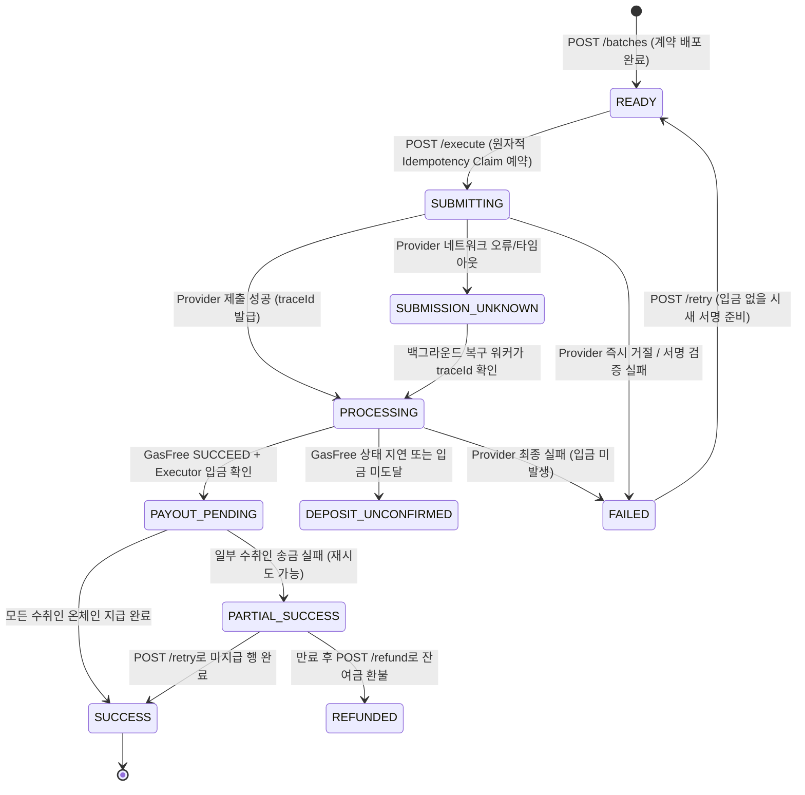

# TRON Batch Payment API 명세서 (API Specification)

본 문서는 `src/server.cjs`, `src/db.cjs`, `src/gasfree.cjs`, `src/tron.cjs`의 실제 구현을 바탕으로 작성된 **TRON Nile 테스트넷 기반 가스 프리(GasFree) 일괄 지급(Batch Payment) 백엔드 서버 API 명세서**입니다.

---

## 1. 개요 및 아키텍처

- **프로젝트 목적**: 사용자가 단 한 번의 TIP-712 가스 프리(`PermitTransfer`) 서명만으로 다수의 수취인에게 TRC-20 토큰(USDT 등)을 가스비 없이 분배할 수 있는 일괄 송금 인프라 제공.
- **주요 워크플로우**:
  1. **견적 (`POST /quote`)**: 클라이언트가 전송할 수취인 목록을 전달하여 가스 프리 수수료 및 릴레이어 예상 비용 산출.
  2. **배치 생성 (`POST /batches`)**: 서버가 Merkle Tree를 구성하고 온체인 `BatchFactory`를 통해 CREATE2 경량 클론 `BatchExecutor`를 사전 배포·초기화.
  3. **사용자 서명 (Client-Side)**: 사용자는 배포된 `BatchExecutor` 주소를 수신자(`receiver`)로 지정하는 TIP-712 `PermitTransfer`에 서명 (개인키는 절대 서버로 전송되지 않음).
  4. **배치 실행 (`POST /batches/:batchId/execute`)**: `Idempotency-Key` 헤더와 함께 서명을 전달하면, 서버가 공식 GasFree Provider에 트랜잭션을 제출하고 온체인 입금 확인 후 각 행별로 Merkle Proof를 제출하여 `BatchExecutor.execute(...)`를 순차 실행.
  5. **상태 모니터링 & 복구**: 단일 배치 상태(`GET /batches/:id`), 수취인별 내역(`GET /batches/:id/payments`), 실시간 SSE 스트림(`GET /batches/:id/events`) 및 자동 복구 워커 제공.

---

## 2. 공통 규격 및 정책

| 항목 | 규격 및 정책 |
| :--- | :--- |
| **기본 URL** | `http://localhost:3000` (포트 기본값: `3000` / 환경변수 `PORT`) |
| **네트워크** | TRON Nile Testnet (`https://nile.trongrid.io`) |
| **인증 (Auth)** | `GET /health`를 제외한 모든 엔드포인트에 `Authorization: Bearer <API_BEARER_TOKEN>` 필수. (최소 32자 이상) |
| **SSE 인증** | 브라우저 `EventSource`의 커스텀 헤더 한계를 지원하기 위해 `ENABLE_SSE_QUERY_TOKEN=1` 설정 시 `?token=<API_BEARER_TOKEN>` 쿼리 파라미터 허용. |
| **요청 본문 포맷** | `Content-Type: application/json` |
| **주소 표기** | TRON Base58 형식 (예: `TPCozYqnistWHH9VaoJtjXp5djKX4VJgai`) |
| **금액 표기** | 토큰의 최소 단위(Base Unit) 정수형 문자열 (예: Nile USDT 6 decimals 기준 1 USDT = `"1000000"`). |
| **시간 단위** | `expiry`, `deadline`: Unix 타임스탬프 (초 단위, seconds)<br>`createdAt`, `updatedAt`: Unix 타임스탬프 (밀리초 단위, ms) |
| **에러 응답 규격** | 실패 시 `{ "error": "에러 설명 메시지" }` 형식의 JSON 반환 |

---

## 3. 상태 머신 (State Machine)

### 3.1 배치 상태 (`batch.status`)


### 3.2 개별 송금 행 상태 (`payment.status`)
- `PENDING`: 지급 대기 중
- `SUBMITTING`: 릴레이어가 `execute` 트랜잭션을 온체인에 브로드캐스트 중
- `CONFIRMED`: 트랜잭션 확정 또는 계약 `paid(index) == true` 검증 완료
- `FAILED`: 트랜잭션 실행 실패 (`OUT_OF_ENERGY`, Revert 등)

---

## 4. API 엔드포인트 명세

### 4.1 시스템 상태 확인 (Health Check)
서버 및 프로세스 동작 상태를 확인합니다. 인증이 필요하지 않습니다.

- **메서드**: `GET`
- **경로**: `/health`
- **인증**: 없음
- **응답 (200 OK)**:
```json
{
  "status": "ok",
  "time": "2026-09-29T08:43:40.123Z"
}
```

---

### 4.2 일괄 지급 견적 조회 (`POST /quote`)
지급할 목록에 대해 GasFree 전송 수수료 및 릴레이어 온체인 실행 예상 수수료(TRX)를 계산합니다.

- **메서드**: `POST`
- **경로**: `/quote`
- **헤더**:
  - `Authorization: Bearer <API_BEARER_TOKEN>`
  - `Content-Type: application/json`
- **요청 본문**:
```json
{
  "sender": "TPCozYqnistWHH9VaoJtjXp5djKX4VJgai",
  "token": "TXYZopYRdj2D9XRtbG411XZZ3kM5VkAeBf",
  "payments": [
    { "recipient": "TPCozYqnistWHH9VaoJtjXp5djKX4VJgai", "amount": "1000000" },
    { "recipient": "TPs87QEVYb6N9g7a8q23eRFf6BrqQLqTJX", "amount": "2000000" }
  ]
}
```
- **요청 필드 제약**:
  - `sender`: 유효한 TRON Base58 사용자 주소
  - `token`: GasFree Provider가 지원하는 TRC-20 토큰 주소
  - `payments`: 1개 이상 1,000개 이하의 배열. 각 `amount`는 양의 정수 문자열
- **응답 (200 OK)**:
```json
{
  "recipientCount": 2,
  "totalAmount": "3000000",
  "estimatedGasFreeFee": "300000",
  "estimatedRelayerFeeTrx": "50.0",
  "estimatedTotal": "3300000",
  "transactionCount": 4
}
```

---

### 4.3 배치 생성 (`POST /batches`)
Merkle Tree를 생성하고 오프체인에서 `BatchFactory`의 CREATE2 결정론적 주소(`predictedAddress`)를 즉시 계산하여 `READY` 상태의 배치를 반환합니다.
- **비용**: **0 TRX** (온체인 트랜잭션을 전송하지 않으므로 릴레이어 가스비 소모 없음)
- **온체인 배포 시점**: GasFree 입금이 온체인에서 확인된 직후, Payout 실행 전에 릴레이어가 자동으로 안전하게 배포합니다.

- **메서드**: `POST`
- **경로**: `/batches`
- **헤더**:
  - `Authorization: Bearer <API_BEARER_TOKEN>`
  - `Content-Type: application/json`
- **요청 본문**:
```json
{
  "sender": "TPCozYqnistWHH9VaoJtjXp5djKX4VJgai",
  "token": "TXYZopYRdj2D9XRtbG411XZZ3kM5VkAeBf",
  "payments": [
    { "recipient": "TPCozYqnistWHH9VaoJtjXp5djKX4VJgai", "amount": "1000000" },
    { "recipient": "TPs87QEVYb6N9g7a8q23eRFf6BrqQLqTJX", "amount": "2000000" }
  ],
  "expiryDuration": 3600
}
```
- **파라미터 설명**:
  - `expiryDuration`: 옵션. 만료 기간(초). 최소 300초 ~ 최대 604,800초 (기본값: 3,600초).
- **응답 (201 Created)**:
```json
{
  "batchId": "b_1790671222552_564f6a4f",
  "batchHash": "0xf0539c58a951654ce63c6324b2a3657094a622981f90b4d55c5ffcc281a54afc",
  "merkleRoot": "0x42eac2242470f20a4cadb14bde5bb66f40cd25320064c1bb2425e70b47899a5c",
  "recipientCount": 2,
  "totalAmount": "3000000",
  "executorAddress": "TSCimoGhAoeVVGzGRyho3bVWxYnfun2vDy",
  "factoryAddress": "TMQYoEzE4LagKinHjKE5GU3MLTtrcuGnFB",
  "implementationAddress": "TY2...someImpl",
  "salt": "0xaf351070fc60a28705177d4be5656c6568f62a42aa89a49749559f550f243368",
  "expiry": 1790674822,
  "status": "READY"
}
```

---

### 4.4 배치 실행 요청 (`POST /batches/:batchId/execute`)
사용자가 서명한 TIP-712 Permit 데이터를 전달하여 GasFree Provider에 입금을 의뢰하고 일괄 배분을 트리거합니다.

- **메서드**: `POST`
- **경로**: `/batches/:batchId/execute`
- **필수 헤더**:
  - `Authorization: Bearer <API_BEARER_TOKEN>`
  - `Idempotency-Key: <UUID 또는 고유 식별 문자열 (1~128자)>`
  - `Content-Type: application/json`
- **요청 본문**:
```json
{
  "authorization": {
    "token": "TXYZopYRdj2D9XRtbG411XZZ3kM5VkAeBf",
    "serviceProvider": "TKtWbdzEq5ss9vTS9kwRhBp5mXmBfBns3E",
    "user": "TPCozYqnistWHH9VaoJtjXp5djKX4VJgai",
    "receiver": "TSCimoGhAoeVVGzGRyho3bVWxYnfun2vDy",
    "value": "3000000",
    "maxFee": "300000",
    "deadline": "1790671402",
    "version": 1,
    "nonce": 5
  },
  "signature": "0x3ef05c210ab0a3843ebdfab9582a56e85143d19aa1a462c41924c322e9af1a7a5a466854b37cb5216dbb20c474db96dfecd316865e1b229764dd73abc16702d91b"
}
```
- **검증 규칙**:
  - `receiver` == 배치의 `executorAddress`
  - `value` == 배치의 `totalAmount`
  - `token` == 배치의 `token`
  - TIP-712 서명 복원 주소 == 배치의 `sender`
- **응답 (200 OK)**:
```json
{
  "batchId": "b_1790671222552_564f6a4f",
  "traceId": "ef36589f-71e1-4f52-80cb-b5491cf646cb",
  "transactionIds": [],
  "status": "PROCESSING"
}
```

---

### 4.5 직접 실행 (`POST /batches/:batchId/execute-direct`)
GasFree 입금 절차 없이, 이미 `BatchExecutor`에 직접 토큰이 입금되어 있는 경우 릴레이어가 즉시 온체인 Payout을 실행하는 관리/테스트용 엔드포인트입니다.

- **메서드**: `POST`
- **경로**: `/batches/:batchId/execute-direct`
- **헤더**: `Authorization: Bearer <API_BEARER_TOKEN>`
- **응답 (200 OK)**:
```json
{
  "batchId": "b_1790671222552_564f6a4f",
  "status": "PROCESSING",
  "fundedBalance": "3000000"
}
```

---

### 4.6 배치 복구 재개 (`POST /batches/:batchId/resume`)
네트워크 단절, 타임아웃 등으로 인해 상태가 멈춘 배치를 온체인 및 Provider 상태와 대조하여 백그라운드 워커에서 즉시 재개합니다.

- **메서드**: `POST`
- **경로**: `/batches/:batchId/resume`
- **헤더**: `Authorization: Bearer <API_BEARER_TOKEN>`
- **응답 (202 Accepted)**:
```json
{
  "batchId": "b_1790671222552_564f6a4f",
  "status": "RECONCILING"
}
```

---

### 4.7 실패 배치 재시도 (`POST /batches/:batchId/retry`)
`FAILED` 또는 `PARTIAL_SUCCESS` 상태의 배치에 대해 재시도를 수행합니다.
- 입금이 완료되어 잔여 잔액이 남아있는 경우: 미지급 수취인에게 Payout을 재시도합니다.
- 입금 전 Provider 단계에서 실패한 경우: 배치를 `READY`로 초기화하여 새 Permit 서명 제출이 가능하도록 만듭니다.

- **메서드**: `POST`
- **경로**: `/batches/:batchId/retry`
- **헤더**: `Authorization: Bearer <API_BEARER_TOKEN>`
- **응답 (202 Accepted / 200 OK)**:
```json
{
  "batchId": "b_1790671222552_564f6a4f",
  "status": "PAYOUT_PENDING"
}
```

---

### 4.8 잔여금 환불 (`POST /batches/:batchId/refund`)
만료 시간(`expiry`)이 경과했거나 전액 지급 후 `BatchExecutor`에 남은 잔여 토큰을 원래 송신자(`sender`) 주소로 환불 호출합니다.

- **메서드**: `POST`
- **경로**: `/batches/:batchId/refund`
- **헤더**: `Authorization: Bearer <API_BEARER_TOKEN>`
- **응답 (200 OK)**:
```json
{
  "batchId": "b_1790671222552_564f6a4f",
  "status": "REFUNDED",
  "refundTxId": "8a6790185f6dc13d26a8ce7f3af9c04d362b23b9e85fa5b7ae90233140f4274e",
  "refundAmount": "1000000"
}
```

---

### 4.9 배치 상세 조회 (`GET /batches/:batchId`)
배치의 기본 정보, 온체인 주소, 입금 트랜잭션, 현재 진행 상태 및 수취인별 카운트를 조회합니다.

- **메서드**: `GET`
- **경로**: `/batches/:batchId`
- **헤더**: `Authorization: Bearer <API_BEARER_TOKEN>`
- **응답 (200 OK)**:
```json
{
  "batchId": "b_1790671222552_564f6a4f",
  "sender": "TPCozYqnistWHH9VaoJtjXp5djKX4VJgai",
  "token": "TXYZopYRdj2D9XRtbG411XZZ3kM5VkAeBf",
  "batchHash": "0xf0539c58a951654ce63c6324b2a3657094a622981f90b4d55c5ffcc281a54afc",
  "merkleRoot": "0x42eac2242470f20a4cadb14bde5bb66f40cd25320064c1bb2425e70b47899a5c",
  "recipientCount": 2,
  "totalAmount": "3000000",
  "executorAddress": "TSCimoGhAoeVVGzGRyho3bVWxYnfun2vDy",
  "expiry": 1790674822,
  "status": "SUCCESS",
  "traceId": "ef36589f-71e1-4f52-80cb-b5491cf646cb",
  "depositTxId": "b0657c635c2792020e5e8f2b3268edbd3a2c69350ab187cac234a0d93560e3e0",
  "providerState": "SUCCEED",
  "errorMessage": null,
  "requestId": "cb5453ae-2a0d-4961-b4a3-9b07b9b25cad",
  "refundTxId": null,
  "refundAmount": null,
  "refundState": null,
  "counts": {
    "total": 2,
    "pending": 0,
    "submitted": 0,
    "success": 2,
    "failed": 0
  }
}
```

---

### 4.10 수취인별 지급 내역 조회 (`GET /batches/:batchId/payments`)
배치에 포함된 모든 수취인의 인덱스, 금액, 온체인 Payout TX 해시 및 에러 상태를 조회합니다.

- **메서드**: `GET`
- **경로**: `/batches/:batchId/payments`
- **헤더**: `Authorization: Bearer <API_BEARER_TOKEN>`
- **응답 (200 OK)**:
```json
[
  {
    "paymentId": "p_b_1790671222552_564f6a4f_0",
    "index": 0,
    "recipient": "TPCozYqnistWHH9VaoJtjXp5djKX4VJgai",
    "amount": "1000000",
    "status": "CONFIRMED",
    "txId": "fd6482ffb2f477b4a2833a03a443773107c1a43cb30b1e605b1a810b84e1abce",
    "errorCode": null,
    "errorMessage": null
  },
  {
    "paymentId": "p_b_1790671222552_564f6a4f_1",
    "index": 1,
    "recipient": "TPs87QEVYb6N9g7a8q23eRFf6BrqQLqTJX",
    "amount": "2000000",
    "status": "CONFIRMED",
    "txId": "e12a4b89...",
    "errorCode": null,
    "errorMessage": null
  }
]
```

---

### 4.11 특정 수취인 단독 재시도 (`POST /batches/:batchId/payments/:index/retry`)
배치 전체가 아닌, 실패했거나 미지급된 특정 단일 수취인(`index` 번호 또는 `paymentId`)만 지정하여 온체인 Payout을 단독 재시도합니다.

- **메서드**: `POST`
- **경로**: `/batches/:batchId/payments/:index/retry`
- **경로 파라미터**:
  - `batchId`: 대상 배치 ID
  - `index`: 수취인 순번 인덱스(0, 1, 2, ...) 또는 고유 `paymentId` (`p_b_..._0`)
- **헤더**: `Authorization: Bearer <API_BEARER_TOKEN>`
- **동작 및 검증 규칙**:
  1. 온체인 `BatchExecutor.paid(index)`를 조회하여 이미 지급된 경우 즉시 `200 CONFIRMED` 반환
  2. 컨트랙트 내 잔여 잔액(`balanceOf`)이 해당 지급액 미만일 경우 `409 Conflict` 반환
  3. 릴레이어가 Merkle Proof와 함께 `BatchExecutor.execute(...)` 단독 트랜잭션 전송
  4. 송금 완료 시 배치 전체 상태(모두 완료 시 `SUCCESS`, 일부 잔여 시 `PARTIAL_SUCCESS`) 자동 갱신
- **성공 응답 (200 OK)**:
```json
{
  "batchId": "b_1790671222552_564f6a4f",
  "paymentId": "p_b_1790671222552_564f6a4f_1",
  "index": 1,
  "status": "CONFIRMED",
  "txId": "e12a4b89345789bcde..."
}
```

---

### 4.12 실시간 이벤트 스트림 (`GET /batches/:batchId/events`)
Server-Sent Events (SSE)를 통해 배치의 진행 상태 및 행별 온체인 트랜잭션 확정 이벤트를 실시간 수신합니다.

- **메서드**: `GET`
- **경로**: `/batches/:batchId/events`
- **헤더**:
  - `Accept: text/event-stream`
  - `Authorization: Bearer <API_BEARER_TOKEN>` (또는 `?token=<API_BEARER_TOKEN>`)
- **응답 스트림 형식**:
```text
: connected

data: payment:0 SUBMITTING

data: payment:0 CONFIRMED tx=fd6482ffb2f477b4a2833a03a443773107c1a43cb30b1e605b1a810b84e1abce

data: payment:1 SUBMITTING

data: payment:1 CONFIRMED tx=e12a4b89...

data: batch SUCCESS
```

---

## 5. 보안 및 안전장치 (Security & Safety)

1. **단일 서명 격리**: 사용자의 개인키는 서버로 전송되지 않으며, 사용자는 오직 배포된 `BatchExecutor` 주소를 수취인으로 한 TIP-712 서명만 생성합니다.
2. **트랜잭션 멱등성 (`Idempotency-Key`)**:
   - `execute` 호출 시 SQLite의 원자적 Claim 예약(`reserveExecution`)을 사용하여 동시 요청에 의한 이중 제출을 물리적으로 방지합니다.
   - 동일 키로 요청 본문이 변경될 경우 `409 Conflict`로 즉시 거절합니다.
3. **온체인 이중 지급 방지 (`paid` Bitmap)**:
   - 스마트 계약 내부에서 `paid[index]` 비트맵을 기록하므로, 서버나 네트워크가 중단 후 재실행되더라도 동일 수취인에 대한 중복 송금이 원천 차단됩니다.
4. **온체인 상태 기반 복구 (Reconciliation)**:
   - 서버 재시작 시 메모리 상태에 의존하지 않고 온체인 실제 토큰 잔액(`balanceOf`) 및 계약의 `paidAmount()`, `paid(index)`를 기준으로 상태를 복구합니다.
5. **릴레이어 Energy/Bandwidth 관리**:
   - 릴레이어 지갑에 충분한 TRX 잔액(최소 50~100 TRX 권장)이 유지되어야 트랜잭션 실행 시 `OUT_OF_ENERGY` 없이 안정적으로 배분이 완료됩니다.
