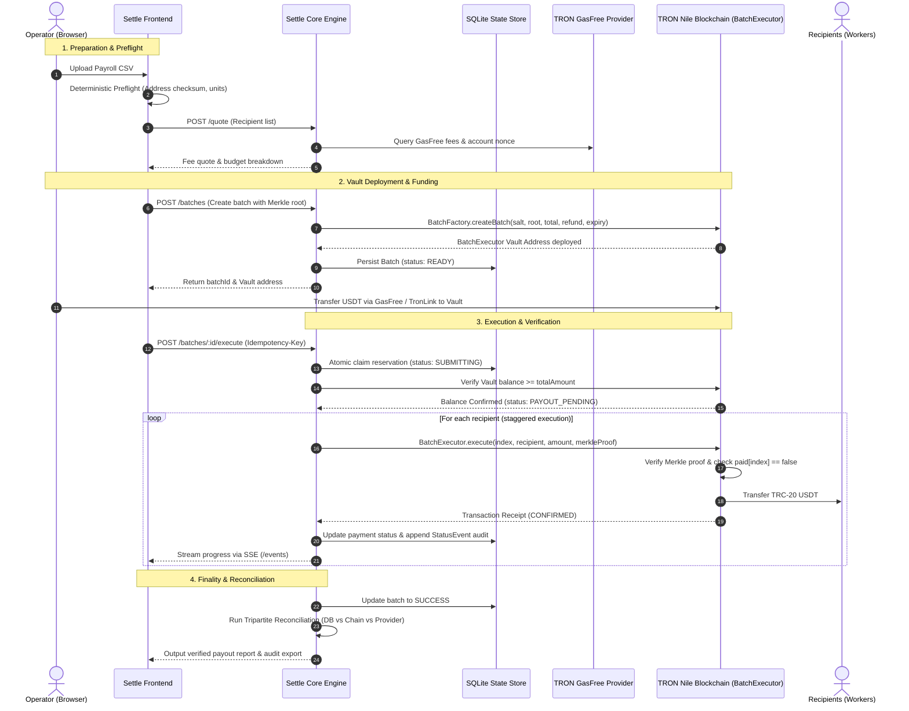
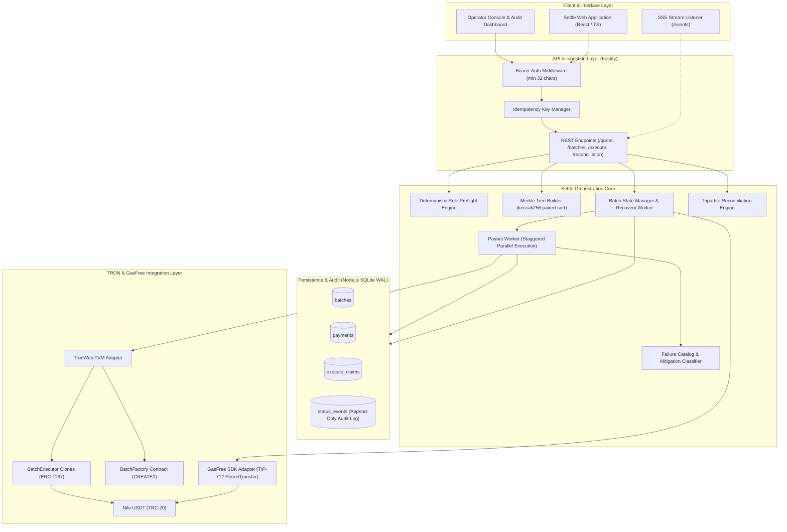
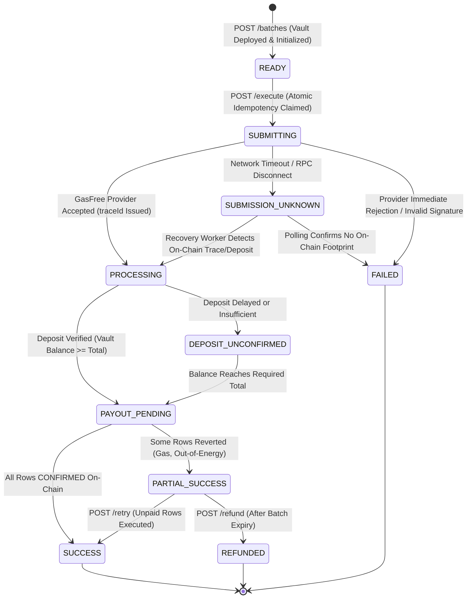
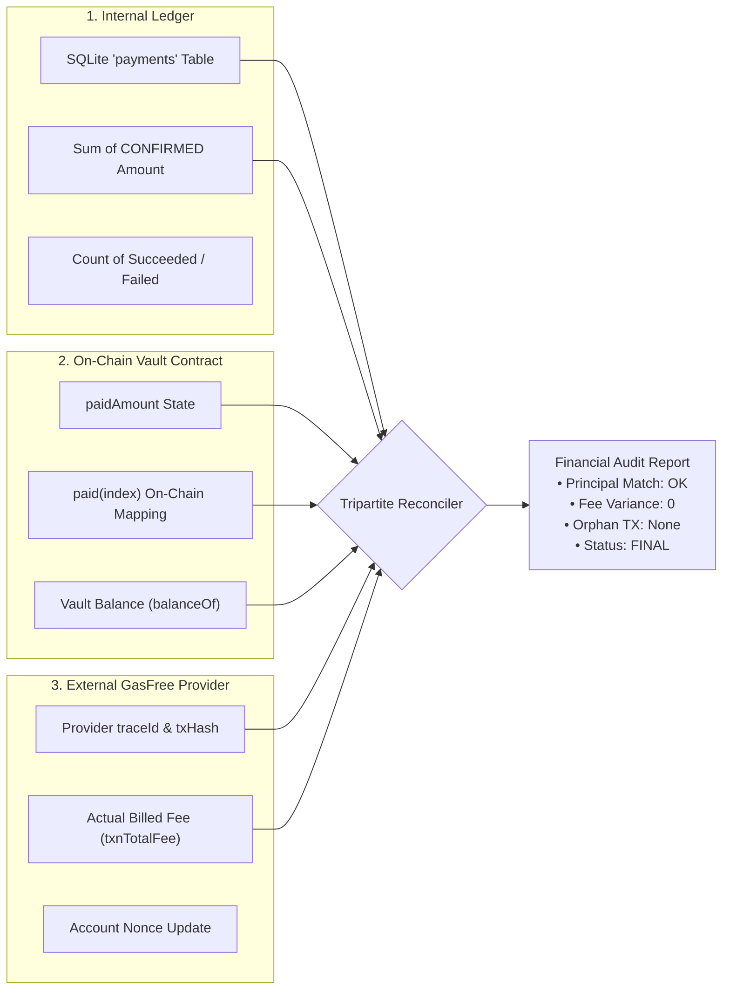

# Settle · GasFree Payroll & Batch Payout Engine on TRON

[](https://nile.tronscan.org)
[](contracts/BatchExecutor.sol)
[](package.json)
[](docs/ENGINE_SCENARIO_TEST_REPORT.md)
[](https://settle-payroll-web.vercel.app)

> **"From a single GasFree deposit to deterministic, verified multi-recipient payouts on TRON."**  
> (단 한 번의 가스프리 입금으로 시작하여, 검증 가능한 다건 급여·정산을 완결하는 엔터프라이즈 지급 엔진)

---

## 🔗 Quick Links & Live Deployments

- **Web Application:** [https://settle-payroll-web.vercel.app](https://settle-payroll-web.vercel.app)
- **Engine Core API:** [https://tron-gasfree-batch-nile-probe.vercel.app](https://tron-gasfree-batch-nile-probe.vercel.app)
- **Canonical API Contract:** [docs/API_CONTRACT_CANONICAL_2026-09-30.md](docs/API_CONTRACT_CANONICAL_2026-09-30.md)
- **Live Nile Factory Contract:** [`TMQYoEzE4LagKinHjKE5GU3MLTtrcuGnFB`](https://nile.tronscan.org/#/contract/TMQYoEzE4LagKinHjKE5GU3MLTtrcuGnFB)
- **Nile Verified Batch Proof:** Batch ID `b_1790707208455_db092e92` ([View Live E2E Report](docs/NILE_LIVE_E2E_RESULTS.md))
- **Demo & Pitch Script (KO):** [docs/DEMO_AND_PITCH_SCRIPT_KO.md](docs/DEMO_AND_PITCH_SCRIPT_KO.md)

---

## 1. Problem & Core Value Proposition

### The Corporate Payout Dilemma on TRON
TRON USDT is the world's highest-volume stablecoin network for cross-border and corporate settlements. However, executing mass payouts (payroll, contributor bounties, vendor invoices) natively faces severe operational hurdles:
1. **TRX Resource Friction:** Senders must manage and burn TRX or freeze resources for Energy/Bandwidth before every transaction.
2. **Custodial Risk in Pooled Wallets:** Conventional multi-senders require depositing funds into centralized platform hot wallets or giving broad contract allowances.
3. **Double-Spending & Timeout Hazards:** When network RPCs time out or nodes lag, naive engines resubmit transactions, risking duplicate payments or stranded funds.
4. **Reconciliation Disconnect:** Transaction hashes in block explorers lack mapping back to individual CSV line items, business memos, and fee attributions.

### Settle's Architectural Solution
Settle bridges TRON's cutting-edge **GasFree Protocol** with an **autonomous, non-custodial batch execution engine**:

- ⛽ **Zero TRX Required for the Payer:** The company funds the payroll batch using pure USDT via TIP-712 `PermitTransfer`. The user never needs to purchase or hold TRX.
- 🛡️ **Non-Custodial Batch Vaults (ERC-1167 Clones):** Each payroll batch is isolated in a lightweight, counterfactual `BatchExecutor` smart contract. Funds never touch a shared pool.
- 🌳 **Cryptographic Merkle Proof Verification:** Payout recipients and amounts are committed into an immutable Merkle root. Each transfer is verified cryptographically on-chain before disbursement.
- 🔄 **Crash-Resilient State Machine:** Every payout step uses atomic SQLite reservation claims. In the event of network disruption, the engine verifies on-chain states (`paid(index)` bitmap) rather than blindly resubmitting.
- 📊 **Tripartite Financial Reconciliation:** Continuous real-time audit comparing the Internal Ledger, On-Chain Contract Vault, and External GasFree Provider fees.

---

## 2. System Architecture & Diagrams

### 2.1 End-to-End System Workflow

The following sequence illustrates the lifecycle of a batch payout from CSV import to on-chain settlement and tripartite reconciliation:



---

### 2.2 Core Engine Component Architecture

Settle is designed as a modular, fail-safe backend orchestrator:



---

### 2.3 Resilient State Machine

Both batches and individual payment rows are modeled with strict lifecycle invariants to prevent duplicate disbursements and preserve idempotency:



---

### 2.4 Tripartite Financial Reconciliation Matrix

Settle guarantees accounting integrity by performing continuous tripartite reconciliation across three independent sources of truth:



---

## 3. Engine Deep-Dive & Engineering Invariants

### 3.1 Non-Custodial Batch Vaults (`BatchFactory` & `BatchExecutor`)
Rather than holding user assets in a shared hot wallet, Settle deploys an **ERC-1167 Minimal Proxy Clone** for every individual batch:
- **Factory Architecture:** `BatchFactory.sol` creates clones of an immutable implementation using TVM `CREATE2`.
- **Deterministic Address Salt:**
  $$\text{salt} = \text{keccak256}(\text{abi.encode}(\text{token}, \text{paymentsRoot}, \text{totalAmount}, \text{refundAddress}, \text{expiry}, \text{batchId}))$$
- **Pre-Initialization Lock:** The vault is initialized in the same transaction with its token address, Merkle root, total amount, refund destination, and expiration timestamp.
- **Guaranteed Expiration Refund:** If a batch expires or completes with remaining funds, `refund()` safely transfers all residual tokens exclusively back to the pre-committed `refundAddress`.

### 3.2 Cryptographic Merkle Proof Verification
Every payout row is committed into an immutable Merkle Tree:
- **Leaf Format:** `keccak256(abi.encode(uint256 index, address recipient, uint256 amount))`
- **Pair Sorting:** Sibling hashes are ordered lexicographically before hashing (`computed < sibling ? keccak256(computed, sibling) : keccak256(sibling, computed)`), with trailing odd nodes carried over.
- **On-Chain Enforcement:** The `BatchExecutor.execute(...)` function verifies that the submitted leaf matches `paymentsRoot`, checks that `paid[index] == false`, sets `paid[index] = true`, increments `paidAmount`, and dispatches tokens. Double-payouts are mathematically impossible on-chain.

### 3.3 Crash-Resilient Execution & Idempotency Claims
To prevent duplicate execution under network instability:
1. **Idempotency Reservation:** Incoming `/execute` calls require an `Idempotency-Key` header and acquire an exclusive SQLite row claim inside an atomic transaction.
2. **No Blind Resubmission:** If an RPC request times out or returns network errors during submission, the status transitions to `SUBMISSION_UNKNOWN`. The engine queries transaction receipts and `paid(index)` bitmap before taking any corrective action.
3. **Staggered Parallel Dispatch:** Individual payouts are dispatched in parallel with a 150ms stagger to prevent TRON node transaction broadcast collisions while maximizing throughput.
4. **Nile USDT Transfer Delta Check:** Standard Nile USDT returns `false` or empty return data even on successful transfers. The contract explicitly verifies token balance deltas (`beforeSelf == afterSelf + amount && afterRecipient == beforeRecipient + amount`) rather than trusting boolean returns.

### 3.4 Failure Catalog & Operator Mitigations
Failures are classified into actionable operational categories via `src/failureCatalog.cjs`:
| Category | Example Root Cause | Engine Action | Operator Resolution |
| :--- | :--- | :--- | :--- |
| `OPERATOR_ACTION` | Relayer TRX balance exhausted | Halt worker dispatch | Top up relayer TRX address |
| `MANUAL_REVIEW` | Transaction broadcast timeout | Preserve pending claim | Reconcile on-chain hash via explorer |
| `RETRYABLE` | Temporary TRON RPC node error | Exponential backoff | Safe to invoke `POST /batches/:id/retry` |
| `FATAL` | Invalid Merkle proof / Bad signature | Mark row FAILED | CSV data corrupted; re-create batch |

---

## 4. AI Preflight & Human-in-the-Loop Governance

In enterprise payroll, artificial intelligence should provide contextual assistance without usurping financial authorization:

1. **Deterministic Rule Engine (Code-Enforced):**
   - Address checksum & TRON base58 validation.
   - Base unit verification (rejecting scientific notation, negative numbers, or overflow).
   - Duplicate recipient address detection.
2. **Contextual AI Review (Advisory Fixture):**
   - Evaluates discrepancy between previous payout averages and current invoices.
   - Parses natural-language work memos to recommend: `INCLUDE`, `HOLD`, or `EXCLUDE`.
   - Explains justification and confidence level to the operator.
3. **Strict Human Authorization Boundary:**
   - AI recommendations never trigger on-chain transactions or modify CSV data autonomously.
   - The human operator holds sole authority to exclude rows, accept discrepancies, and trigger wallet deposits.

---

## 5. Live Nile Testnet Verification

Settle has been extensively tested on the **TRON Nile Testnet** and validated against 107 engine scenario tests:

- **Factory Contract Address:** [`TMQYoEzE4LagKinHjKE5GU3MLTtrcuGnFB`](https://nile.tronscan.org/#/contract/TMQYoEzE4LagKinHjKE5GU3MLTtrcuGnFB)
- **Live 3-Row Batch Execution:** Batch `b_1790707208455_db092e92`
  - Total Volume: `60,000` (0.06 Nile USDT)
  - Payment 0 (0.01 USDT): [Tx Hash](https://nile.tronscan.org/#/transaction/58428238622c1dae29e924bcfe75b5b9f71c1b18d2da903ce4b9679f187a53e6)
  - Payment 1 (0.02 USDT): [Tx Hash](https://nile.tronscan.org/#/transaction/eeea48408f6d61d1981d3bc42c7594916a244c0840b2bc03a5e8c187be06ad90)
  - Payment 2 (0.03 USDT): [Tx Hash](https://nile.tronscan.org/#/transaction/aa58f844b6796da34c7a6e1d7463aa1fba13f9fc32512f4b46c6fc3dcbe353e8)
  - Status: `SUCCESS` / All 3 Confirmed.
- **Live Expiration & Unclaimed Refund:** Verified in [docs/NILE_LIVE_E2E_RESULTS.md](docs/NILE_LIVE_E2E_RESULTS.md).

---

## 6. Getting Started & Verification

### Prerequisites
- Node.js >= 22.0.0
- npm >= 10.0.0
- TronLink Chrome Extension (configured for Nile Testnet)

### Local Installation & Testing
```bash
# Clone the repository
git clone https://github.com/cosmosery/gwdc-hackathon.git
cd gwdc-hackathon

# Install root dependencies
npm install

# Run comprehensive engine scenario tests (107 tests passing)
npm run test:engine:scenarios
npm run test:contract:scenarios
npm run test:recovery:boundaries
npm run test:merge

# Run frontend test suite
npm run test:web
```

### Running the Engine Server
```bash
cp .env.example .env
# Configure .env with your NILE_RELAYER_PRIVATE_KEY and NILE_FACTORY_ADDRESS

# Start Fastify Engine Server on port 3000
npm start
```

### Deploying the Frontend
```bash
cd web
npm install
npm run build
# Deploy to Vercel
npx vercel --prod
```

---

## 7. Tech Stack

- **Smart Contracts:** Solidity 0.8.20, OpenZeppelin Clones (ERC-1167), TVM `create2`
- **Engine Core:** Node.js 22, Fastify v5, `@gasfree/gasfree-sdk`, TronWeb, ethers v6, `node:sqlite` (DatabaseSync with WAL mode)
- **Frontend dApp:** React 18, TypeScript, Vite, TailwindCSS, Comfortable Design System
- **Testing & Tooling:** Ganache local EVM runner, custom boundary & fault-injection harness

---

## 8. License

This project is licensed under the [MIT License](LICENSE).
